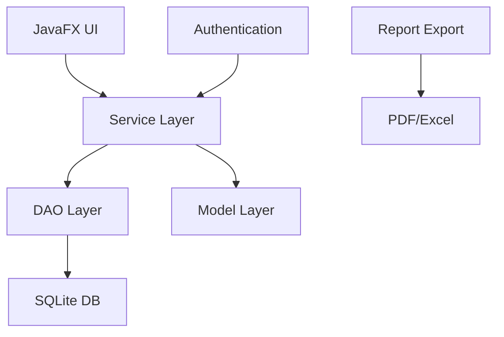

# Water and Sewage Management System - Architecture Plan

## System Overview
This is a modular Java-based system for AAWSA, focusing on customer management, meter readings, billing, and payments. It uses JavaFX for UI, JDBC for database access, and SQLite for data storage. Follows MVC, SOLID, and layered architecture.

## Architecture Layers
- **Presentation Layer (ui package)**: JavaFX screens for user interaction.
- **Service Layer (service package)**: Business logic for bill calculation, payments.
- **Data Access Layer (dao package)**: DAO pattern with JDBC.
- **Model Layer (model package)**: Customer, Bill, Payment entities.
- **Utility Layer (util package)**: DB connection, helpers.

## Customer Types and Tariffs
- Household (HH): 5 ETB/m³
- Business (BS): 10 ETB/m³
- Government (GOV): 3 ETB/m³
- Customer IDs: Prefix + number, e.g., HH-10234

## Database Schema
Tables:
- users: id, username, password, role
- customers: id, customer_code, name, address, meter_number, customer_type, previous_reading, balance
- meter_readings: id, customer_id, reading_date, current_reading, consumption
- bills: id, customer_id, bill_date, consumption, total_amount, status
- payments: id, bill_id, amount, payment_date, payment_method

## User Roles
- Admin: full access, reports, manage customers
- Clerk: register customers, meter readings, bills, payments
- Customer: payment-only workflow

## Functional Modules
1. Customer Management
2. Meter Reading & Usage
3. Billing
4. Customer Payment Flow (with method selection and receipt)
5. Reports & Administration

## Payment Flow
- Enter account ID
- Display unpaid balance, consumption, rate
- Select payment method (CBE, Abissinia, TeleBirr, Wash)
- Confirm payment
- Generate receipt (PDF or on-screen)

## UI Structure
- Login screen
- Dashboards for Admin/Clerk
- Customer registration
- Meter reading entry
- Billing view
- Payment screen with method selection and receipt option
- Reports with PDF/Excel export

## Mermaid Diagram

## Implementation Plan
See todo list for detailed steps.